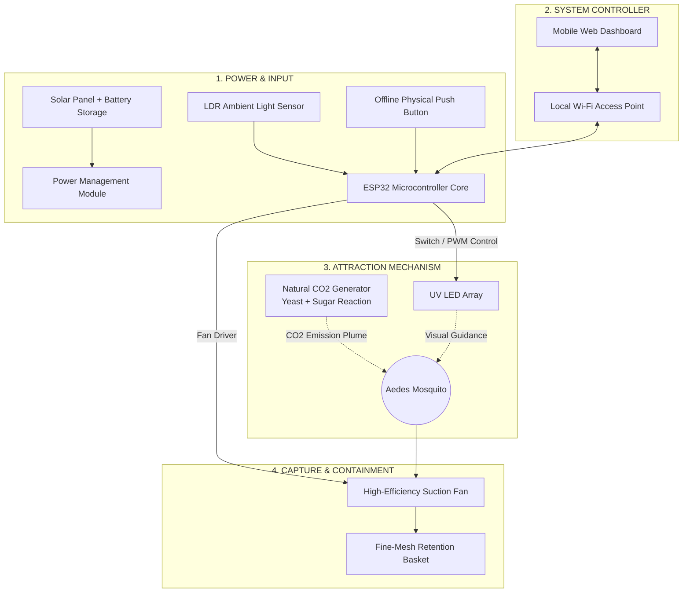

<div align="center">

  

  # 🦟 AEDES-X · IoT Rangers
  ### **Smarter Protection · Smart Mosquito Trap Prototype**
  *Community-Centric STEM Innovation & IoT Control — SJKT Ladang Rinching*

  <br/>

  [](https://github.com/shamsir99/Aedes-X-Landing-page)
  [](https://github.com/shamsir99/Aedes-X-Landing-page)
  [](https://github.com/shamsir99/Aedes-X-Landing-page)
  [](https://github.com/shamsir99/Aedes-X-Landing-page)
  [](LICENSE)

  <br/>

  <p align="center">
    <a href="#-executive-summary">Executive Summary</a> •
    <a href="#-key-landing-page-features">Web Features</a> •
    <a href="#-system-architecture-hardware--iot">System Architecture</a> •
    <a href="#-3-flexible-operating-modes">3 Operating Modes</a> •
    <a href="#-smart-iot-dashboard">IoT Dashboard</a> •
    <a href="#-comparative-benchmark">Comparison</a> •
    <a href="#-installation--deployment-guide">Deployment</a> •
    <a href="#-team--acknowledgments">Team & Partners</a>
  </p>

  

</div>

---

## 📖 Executive Summary

**AEDES-X** is a next-generation smart mosquito trap prototype designed and engineered by **IoT Rangers** from **SJKT Ladang Rinching**.

The project synergizes natural biological attraction principles with modern embedded IoT engineering:
- 🧪 **Biological CO₂ Attraction** (organic yeast, sugar, and warm water fermentation).
- 💡 **UV Optical Attraction Waveband** to guide mosquitoes directly toward the intake.
- 🌀 **Centrifugal Airflow Suction** via a DC fan into a secured escape-proof fine-mesh chamber.
- 📱 **ESP32 Microcontroller IoT Architecture** with dual control schemes (Local Web Hotspot Dashboard + Offline Physical Push Button).

This landing page is engineered with high-end aesthetic fidelity, an Apple-inspired scroll-driven interactive experience, and seamless bilingual support (Bahasa Melayu & English) to present the innovation at the **2026 National STEM Competition**.

---

## ✨ Key Landing Page Features

| Feature | Technical Implementation |
| :--- | :--- |
| 🎬 **Cinematic Scroll Experience** | 120-frame serialized WebP sequence dynamically drawn onto an HTML5 `<canvas>` synced with viewport scroll position. |
| 🔍 **Interactive 5-Stage Exploded View** | Exploded component view highlighting the 5 key hardware sub-systems with active stage indicators. |
| 🕹️ **Interactive 3-Mode Console** | Real-time video switching showcase (*Manual*, *Auto LDR*, *Timer*) with contextual triggers and recommended environments. |
| 📱 **Phone Mockup Dashboard Explorer** | Interactive phone UI viewer navigating 4 live screens (Home, Control, Timer, System) with smart maintenance reminders. |
| ⚖️ **Head-to-Head Comparison Lab** | 3D-tilted product comparison matrix evaluating AEDES-X against Fogging, Aerosol, Mosquito Coils, and Traditional UV Traps. |
| 📊 **Transparent Early Validation** | Documented bench-test telemetry (0.6s – 8.4s response times) accompanied by rigorous scientific disclaimers. |
| 🌐 **Zero-Reload Dual Language (BM / EN)** | Instant language switching without page reloads using DOM dataset binding and persistent `localStorage`. |
| ⚡ **Zero-Dependency Native Stack** | Crafted in pure Vanilla HTML5, modern CSS3 custom properties, and Vanilla JavaScript for instant zero-build rendering. |

---

## 🔬 System Architecture (Hardware & IoT)



<div align="center">
  
  <p><em>AEDES-X 5-Stage Hardware Exploded Component Diagram</em></p>
</div>

---

## 🕹️ 3 Flexible Operating Modes

1. **Manual Mode (Direct Control)**
   - Instant manual on/off toggling via the mobile dashboard or physical push button.
   - Ideal for live demonstrations, laboratory testing, and targeted indoor use.
2. **Auto LDR Mode (Light-Dependent Sensor)**
   - Automatically activates based on ambient light thresholds (specifically dusk and dawn when *Aedes aegypti* and *Aedes albopictus* are most active).
   - Maximizes battery conservation during broad daylight hours.
3. **Timer Mode (Scheduled Operation)**
   - Operates on user-defined time intervals (e.g., active right before students arrive and after school dismissal).
   - Tailor-made for schools, administrative offices, and community centers.

---

## 📱 Smart IoT Dashboard

The AEDES-X web dashboard is hosted directly by the ESP32 on-chip HTTP web server via a self-contained local Wi-Fi Access Point:

<div align="center">
  <table>
    <tr>
      <td align="center"><b>01. Home</b></td>
      <td align="center"><b>02. Control</b></td>
      <td align="center"><b>03. Timer</b></td>
      <td align="center"><b>04. System</b></td>
    </tr>
    <tr>
      <td></td>
      <td></td>
      <td></td>
      <td></td>
    </tr>
  </table>
  <p><em>AEDES-X Mobile-First Web Dashboard Interface</em></p>
</div>

- **Smart Maintenance Notifications**: Proactive cycle countdowns reminding operators when to empty the mesh basket and replenish the yeast-sugar CO₂ mixture.
- **Fail-Safe Offline Mode**: If wireless connectivity or phone access drops, the hardware button on the enclosure seamlessly cycles operating modes.

---

## ⚖️ Comparative Benchmark Matrix

| Parameter | Periodic Fogging | Aerosol Spray | Mosquito Coil | Traditional UV Trap | 🦟 **AEDES-X IoT** |
| :--- | :---: | :---: | :---: | :---: | :---: |
| **CO₂ Biomimetic Lure** | ❌ No | ❌ No | ❌ No | ❌ No | ✅ **Yes (Yeast + Sugar)** |
| **Chemical-Free / Non-Toxic** | ❌ Toxic mist | ❌ Chemical residue | ❌ Carcinogenic smoke | ✅ Safe | ✅ **100% Eco-Friendly** |
| **Smart IoT Control** | ❌ Manual | ❌ Manual | ❌ None | ❌ Basic rocker switch | ✅ **Web App + 3 Modes** |
| **Ambient Light Sensor** | ❌ No | ❌ No | ❌ No | ❌ Rare | ✅ **Integrated LDR** |
| **Offline Hardware Fail-Safe** | — | — | — | — | ✅ **Physical Push Button** |
| **Maintenance Tracking** | ❌ Manual logs | ❌ None | ❌ None | ❌ None | ✅ **Digital Reminders** |

---

## 🌍 UN Sustainable Development Goals (SDG Alignment)

The AEDES-X initiative is engineered to deliver measurable social and educational impact:

<div align="center">
  <table>
    <tr>
      <td width="50%" align="center">
        <br/>
        <b>SDG 3: Good Health and Well-Being</b><br/>
        <sub>Mitigating community dengue outbreaks in residential areas and schools without exposing residents to hazardous chemical residues or respiratory irritants.</sub>
      </td>
      <td width="50%" align="center">
        <br/>
        <b>SDG 9: Industry, Innovation, and Infrastructure</b><br/>
        <sub>Nurturing primary school innovators in applied STEM, IoT hardware programming, sensor integration, and sustainable product design.</sub>
      </td>
    </tr>
  </table>
</div>

---

## 🚀 Installation & Deployment Guide

This landing page is built using **100% Static HTML/CSS/JS** — zero package managers, zero build steps, and zero dependencies required!

### 1. Running Locally
To ensure video playback and scroll canvas frames stream smoothly without local file CORS restrictions:

```bash
# Clone the repository
git clone https://github.com/shamsir99/Aedes-X-Landing-page.git
cd Aedes-X-Landing-page

# Launch a lightweight web server (Python 3):
python -m http.server 8000

# Or using Node (npx):
npx serve .
```
Open your browser and navigate to `http://localhost:8000`.

### 2. Deploying to GitHub Pages (1-Click)
1. Navigate to the **Settings** tab in this GitHub repository.
2. Select **Pages** from the left navigation menu.
3. Under **Build and deployment > Source**, select `Deploy from a branch`.
4. Choose the `main` branch and the `/(root)` directory.
5. Click **Save**. Your live website will be accessible globally within moments!

---

## 📁 Repository Directory Structure

```text
├── assets/
│   ├── aedes-x-cinematic-v2.mp4       # High-definition cinematic background video
│   ├── aedes-x-hero.png               # High-resolution 3D product hero rendering
│   ├── aedes-x-logo-horizontal.png    # Official horizontal brand identity logo
│   ├── aedes-x-logo-stacked.png       # Official stacked logo variation
│   ├── aedes-x-mark.png               # Minimal brand icon mark
│   ├── aedes-x-exploded-transparent.png # Transparent exploded component diagram
│   ├── cinematic-frames/              # 120 WebP sequence frames for canvas scroll engine
│   ├── dashboard-*.png                # High-fidelity ESP32 dashboard screen captures
│   ├── *-mode.mp4                     # Demonstration clips for each of the 3 modes
│   ├── school-logo-transparent.png    # SJKT Ladang Rinching school crest
│   └── sdg-*.png                      # Official United Nations SDG emblems
├── index.html                         # Semantic HTML5 markup with dual-language bindings
├── styles.css                         # Custom CSS design system with micro-interactions
├── app.js                             # Canvas scroll controller, mode switcher & i18n logic
└── README.md                          # Comprehensive project documentation
```

---

## 👥 Team & Acknowledgments

<div align="center">
  
  
  ### **IOT RANGERS**
  **SJKT LADANG RINCHING · 2026**
  
  *In Proud Collaboration & Partnership With:*<br/>
  <br/>
   &nbsp;&nbsp;&nbsp;&nbsp;
   &nbsp;&nbsp;&nbsp;&nbsp;
  
  
  <br/><br/>
  <p><em>"Small Innovation. Meaningful Impact."</em></p>
</div>
