<div align="center">

  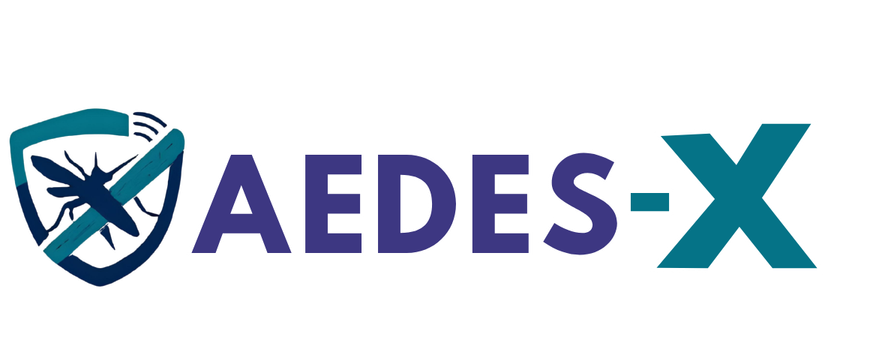

  # 🦟 AEDES-X · IoT Rangers
  ### **Perlindungan Lebih Pintar · Smart Mosquito Trap Prototype**
  *Inovasi STEM & Kawalan IoT Berteraskan Komuniti — SJKT Ladang Rinching*

  <br/>

  [](https://github.com/shamsir99/Aedes-X-Landing-page)
  [](https://github.com/shamsir99/Aedes-X-Landing-page)
  [](https://github.com/shamsir99/Aedes-X-Landing-page)
  [](https://github.com/shamsir99/Aedes-X-Landing-page)
  [](LICENSE)

  <br/>

  <p align="center">
    <a href="#-tentang-aedes-x">Tentang Projek</a> •
    <a href="#-ciri-ciri-utama-landing-page">Ciri-Ciri Web</a> •
    <a href="#-seni-bina-sistem-hardware--iot">Seni Bina Sistem</a> •
    <a href="#-3-mod-operasi">3 Mod Operasi</a> •
    <a href="#-papan-pemuka-iot">Papan Pemuka</a> •
    <a href="#-matriks-perbandingan">Perbandingan</a> •
    <a href="#-panduan-pemasangan--deploy">Deployment</a> •
    <a href="#-pasukan--penghargaan">Pasukan</a>
  </p>

  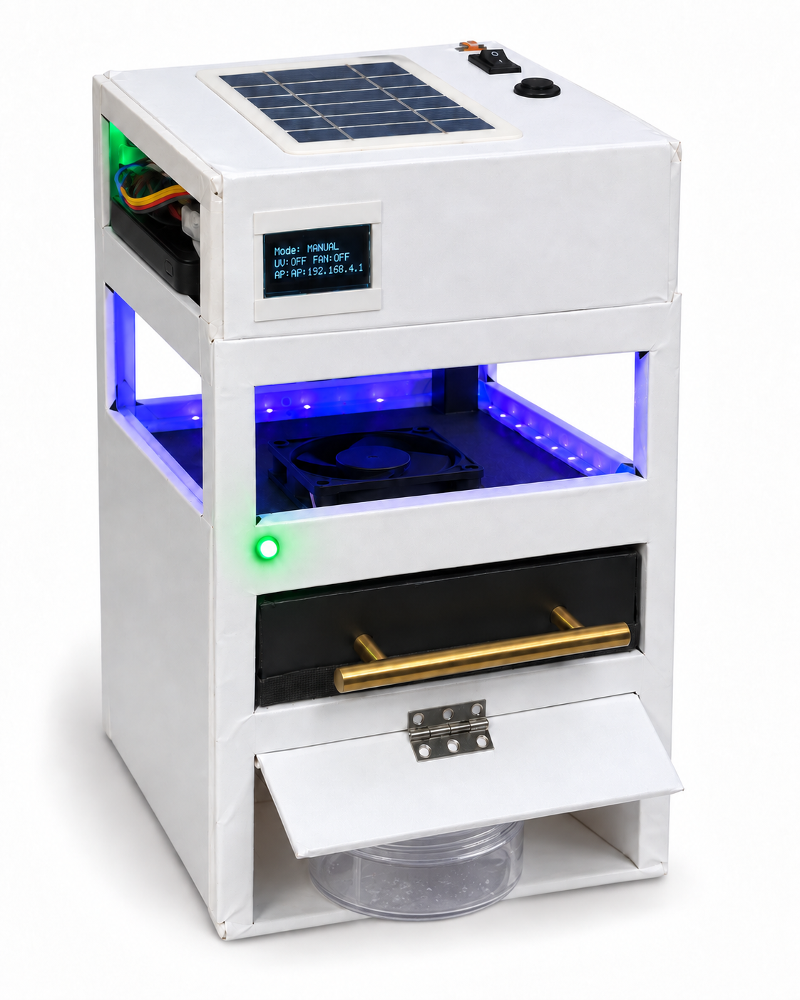

</div>

---

## 📖 Ringkasan Eksekutif (Executive Summary)

**AEDES-X** merupakan sebuah prototaip perangkap nyamuk pintar generasi baharu yang direka dan dibangunkan oleh pasukan **IoT Rangers** dari **SJKT Ladang Rinching**.

Projek ini menggabungkan prinsip sains tarikan semulajadi dan kejuruteraan moden:
- 🧪 **Tarikan CO₂ Biologikal** (tindak balas yis, gula dan air suam).
- 💡 **Tarikan Cahaya Gelombang UV**.
- 🌀 **Aliran Udara Sedutan Kipas DC** ke dalam bakul jaring halus berkeselamatan.
- 📱 **Sistem Kawalan IoT Berasaskan Mikropengawal ESP32** dengan dwi-kawalan (Papan Pemuka Web Hotspot Setempat + Butang Fizikal Tanpa Talian).

Landing page ini dicipta khusus dengan mutu visual ultra-premium, interaktiviti ala produk Apple, dan sokongan penuh dwibahasa (Bahasa Melayu & English) untuk mempamerkan projek di **Peringkat Kebangsaan 2026**.

---

## ✨ Ciri-Ciri Utama Landing Page

| Ciri | Penerangan Teknikal |
| :--- | :--- |
| 🎬 **Cinematic Scroll Experience** | Simulasi video 120-frame WebP bersiri yang dilukis secara dinamik ke HTML5 `<canvas>` mengikut kedudukan skrol pengguna. |
| 🔍 **Interactive 5-Stage Exploded View** | Paparan komponen terurai (exploded diagram) interaktif yang menonjolkan 5 sub-sistem utama AEDES-X beserta penerangan teliti. |
| 🕹️ **Interactive 3-Mode Console** | Konsol bertukar video langsung (*Manual*, *Auto LDR*, *Pemasa*) dengan pemapar status masa nyata dan penerangan konteks kegunaan. |
| 📱 **Phone Mockup Dashboard Explorer** | Interaksi langsung skrin papan pemuka telefon pintar (Utama, Kawalan, Pemasa, Sistem) beserta kad peringatan penyelenggaraan pintar. |
| ⚖️ **Comparison Lab (Head-to-Head)** | Matriks perbandingan interaktif AEDES-X melawan kaedah konvensional (Fogging, Semburan Aerosol, Lingkaran Ubat Nyamuk, Perangkap UV Biasa). |
| 📊 **Early Validation Metrics** | Laporan telus data ujian makmal awal (kependaman 0.6s - 8.4s) dengan penafian saintifik beretika sebelum ujian rasmi September 2026. |
| 🌐 **Sistem Dwi-Bahasa (BM & EN)** | Penukaran bahasa serta-merta tanpa muat semula halaman melalui *DOM dataset binding* dan *localStorage*. |
| ⚡ **Zero-Dependency Native Stack** | Dibina 100% menggunakan Vanilla HTML5, CSS3 moden, dan Vanilla JavaScript tulen — pantas, ringan, tanpa komplikasi *build step*. |

---

## 🔬 Seni Bina Sistem (Hardware & IoT)

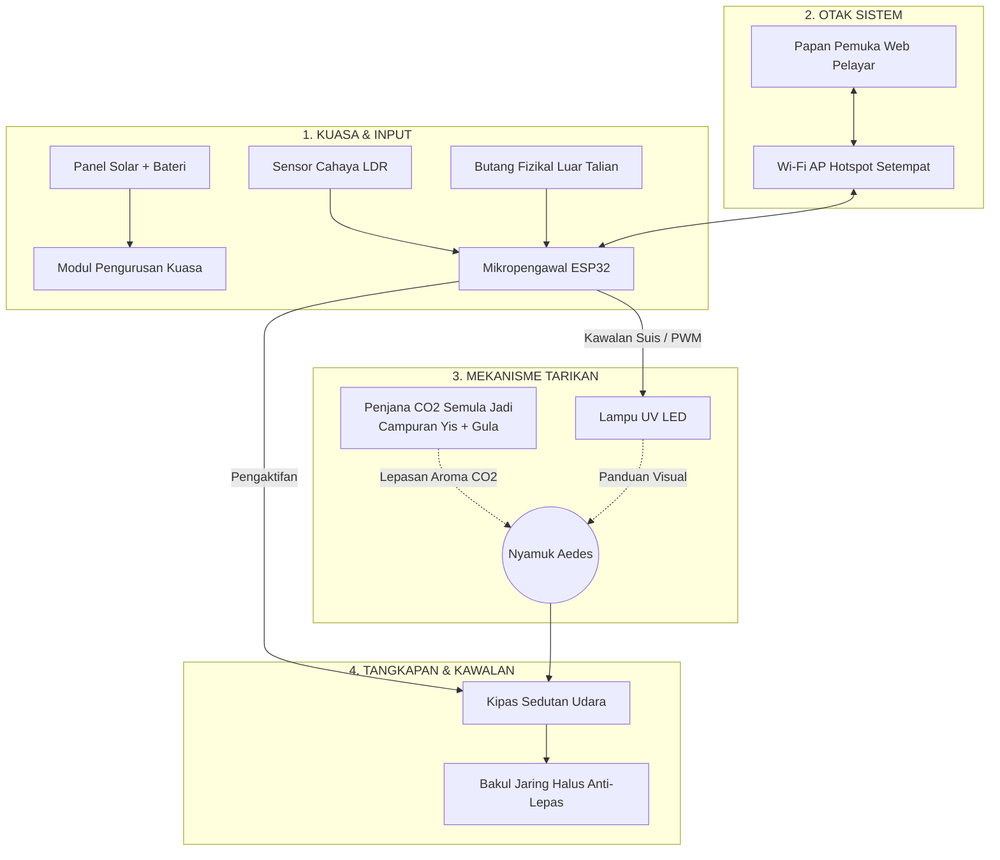

<div align="center">
  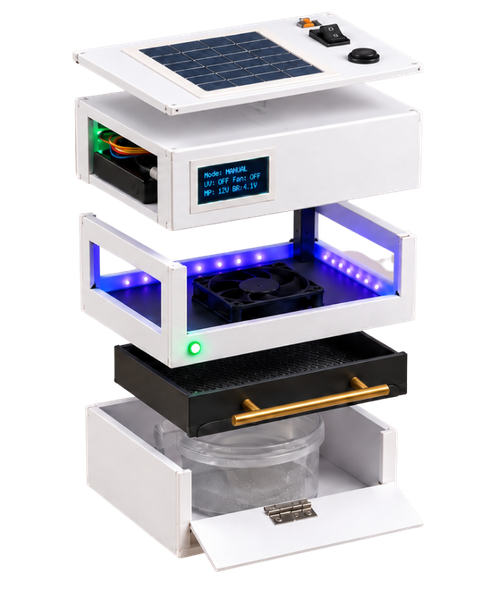
  <p><em>Rajah Komponen Terurai 5 Peringkat AEDES-X</em></p>
</div>

---

## 🕹️ 3 Mod Operasi Fleksibel

1. **Mod Manual (Direct Control)**
   - Kawalan hidup/mati secara terus pada papan pemuka telefon atau butang fizikal.
   - Sesuai untuk demonstrasi, ujian makmal dan ruang tamu kediaman.
2. **Mod Auto LDR (Light Dependent Resistor)**
   - Aktif secara automatik mengikut tahap keamatan cahaya persekitaran (waktu senja dan fajar di mana nyamuk Aedes paling agresif).
   - Menjimatkan penggunaan tenaga suria pada waktu tengah hari.
3. **Mod Pemasa (Timer / Scheduled Operation)**
   - Beroperasi mengikut selang waktu yang diprogramkan (cth: beroperasi sebelum waktu murid tiba dan selepas tamat sesi persekolahan).
   - Sangat ideal untuk sekolah, dewan komuniti dan premis pejabat.

---

## 📱 Papan Pemuka Pintar (IoT Dashboard)

Papan pemuka AEDES-X dihoskan terus dari pelayan mikro ESP32 (Local Web Server) melalui rangkaian Wi-Fi Hotspot tertutup:

<div align="center">
  <table>
    <tr>
      <td align="center"><b>01. Utama</b></td>
      <td align="center"><b>02. Kawalan</b></td>
      <td align="center"><b>03. Pemasa</b></td>
      <td align="center"><b>04. Sistem</b></td>
    </tr>
    <tr>
      <td>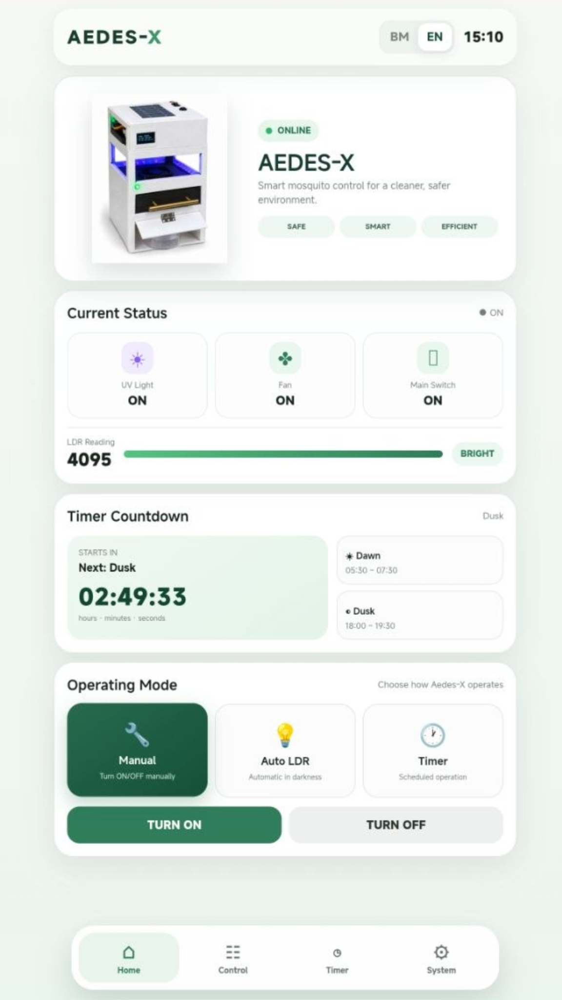</td>
      <td>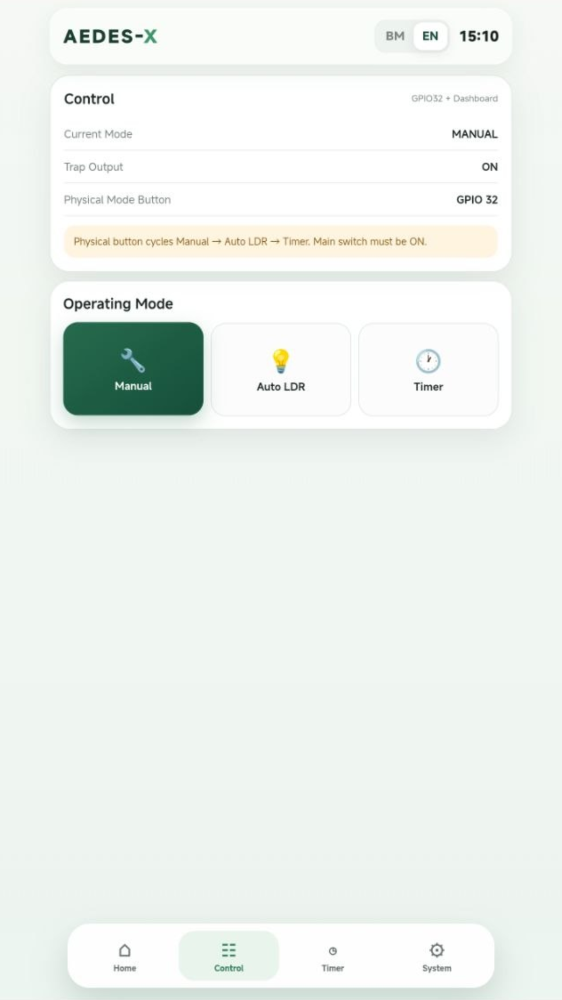</td>
      <td>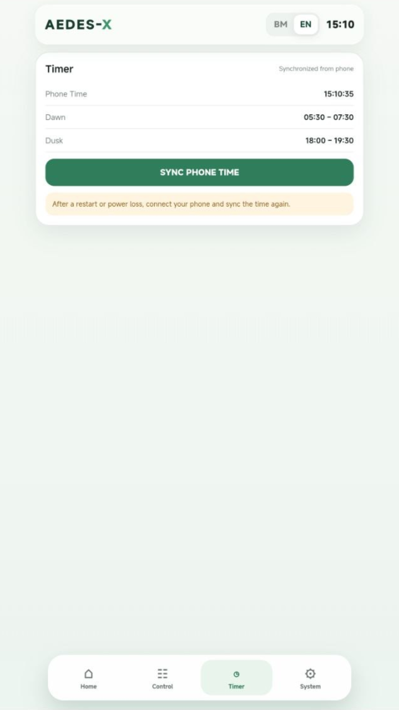</td>
      <td>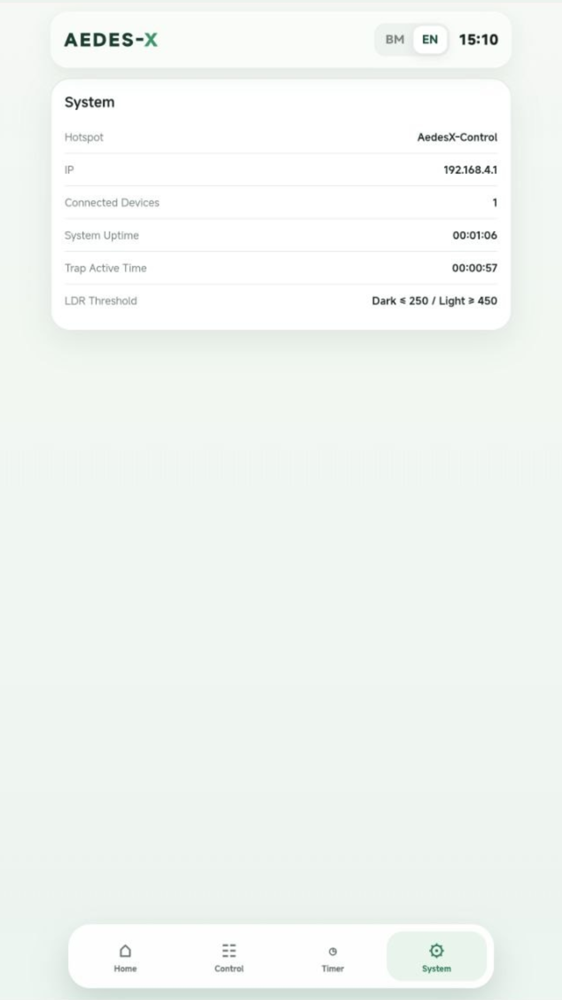</td>
    </tr>
  </table>
  <p><em>Paparan 4 Skrin Utama Papan Pemuka Mudah Alih AEDES-X</em></p>
</div>

- **Peringatan Penyelenggaraan Pintar**: Kiraan hari berkala untuk pembersihan jaring dan penggantian bahan yis CO₂.
- **Fail-Safe Butang Fizikal**: Jika sambungan telefon atau hotspot terputus, butang fizikal pada badan peranti tetap boleh mengubah mod tanpa sebarang gangguan.

---

## ⚖️ Matriks Perbandingan Kaedah Kawalan Nyamuk

| Parameter | Fogging Berkala | Semburan Aerosol | Lingkaran Ubat Nyamuk | Perangkap UV Biasa | 🦟 **AEDES-X IoT** |
| :--- | :---: | :---: | :---: | :---: | :---: |
| **Tarikan Spesifik CO₂** | ❌ Tiada | ❌ Tiada | ❌ Tiada | ❌ Tiada | ✅ **Ada (Yis & Gula)** |
| **Bebas Racun Kimia** | ❌ Toksik | ❌ Beracun | ❌ Asap karsinogen | ✅ Selamat | ✅ **100% Mesra Alam** |
| **Kawalan Pintar / IoT** | ❌ Manual | ❌ Manual | ❌ Tiada | ❌ Suis asas | ✅ **Web App + 3 Mod** |
| **Penderia Cahaya (LDR)**| ❌ Tiada | ❌ Tiada | ❌ Tiada | ❌ Jarang ada | ✅ **Sensor Terbina** |
| **Sandaran Luar Talian** | — | — | — | — | ✅ **Butang Fizikal** |
| **Peringatan Servis** | ❌ Jadual luar | ❌ Tiada | ❌ Tiada | ❌ Tiada | ✅ **Notifikasi Digital** |

---

## 🌍 Matlamat Pembangunan Mampan (SDG Alignment)

Projek AEDES-X dibangunkan bukan sekadar alat teknologi, tetapi penyelesaian berimpak sosial:

<div align="center">
  <table>
    <tr>
      <td width="50%" align="center">
        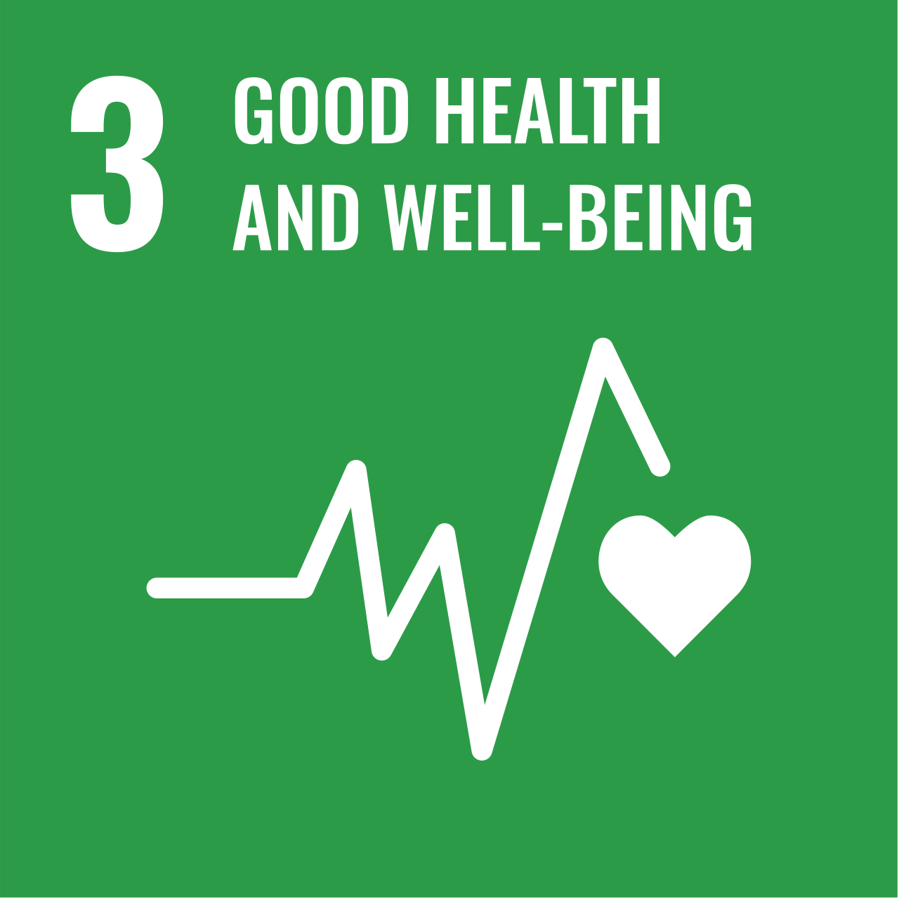<br/>
        <b>SDG 3: Kesihatan Baik dan Kesejahteraan</b><br/>
        <sub>Membantu mencegah penularan demam denggi dalam komuniti sekolah dan kediaman tanpa mencemarkan udara dengan bahan kimia berbahaya.</sub>
      </td>
      <td width="50%" align="center">
        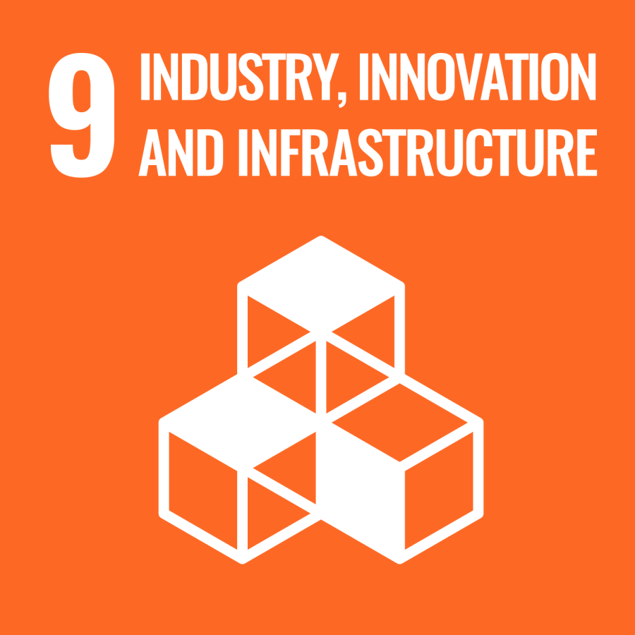<br/>
        <b>SDG 9: Industri, Inovasi dan Infrastruktur</b><br/>
        <sub>Memupuk bakat muda dalam bidang sains gunaan, IoT, pengaturcaraan mikropengawal dan reka bentuk kejuruteraan lestari.</sub>
      </td>
    </tr>
  </table>
</div>

---

## 🚀 Panduan Pemasangan & Menjalankan Laman Web

Laman web ini adalah **100% Static HTML/CSS/JS** — tidak memerlukan pemasangan npm, node_modules, atau kompilasi rumit!

### 1. Menjalankan Secara Tempatan (Localhost)
Untuk memastikan video dan kanvas frame berjalan lancar tanpa sekatan CORS pelayar:

```bash
# Klon repositori
git clone https://github.com/shamsir99/Aedes-X-Landing-page.git
cd Aedes-X-Landing-page

# Jalankan pelayan web ringkas (menggunakan Python):
python -m http.server 8000

# Atau menggunakan Node (npx):
npx serve .
```
Buka pelayar web dan layari `http://localhost:8000`.

### 2. Pelancaran ke GitHub Pages (1-Klik)
1. Pergi ke tab **Settings** di repositori GitHub anda.
2. Pada menu kiri, klik **Pages**.
3. Di bahagian **Build and deployment > Source**, pilih `Deploy from a branch`.
4. Pilih cawangan `main` dan direktori `/(root)`.
5. Klik **Save**. Laman anda akan aktif secara percuma dalam masa 1 minit!

---

## 📁 Struktur Fail Repositori

```text
├── assets/
│   ├── aedes-x-cinematic-v2.mp4       # Video cinematic resolusi tinggi
│   ├── aedes-x-hero.png               # Visual render hero produk
│   ├── aedes-x-logo-horizontal.png    # Logo rasmi horizontal AEDES-X
│   ├── aedes-x-logo-stacked.png       # Logo rasmi bertingkat
│   ├── aedes-x-mark.png               # Simbol ikon jenama AEDES-X
│   ├── aedes-x-exploded-transparent.png # Rajah komponen terurai
│   ├── cinematic-frames/              # 120 bingkai WebP untuk scroll canvas
│   ├── dashboard-*.png                # Tangkapan skrin antara muka ESP32
│   ├── *-mode.mp4                     # Video demonstrasi 3 mod operasi
│   ├── school-logo-transparent.png    # Logo rasmi SJKT Ladang Rinching
│   └── sdg-*.png                      # Lencana rasmi SDG PBB
├── index.html                         # Struktur semantik HTML5 & dwi-bahasa
├── styles.css                         # Sistem reka bentuk CSS bertaraf tinggi
├── app.js                             # Enjin skrol kanvas, video switcher & interaktiviti
└── README.md                          # Dokumentasi lengkap & analisis projek
```

---

## 👥 Pasukan & Penghargaan

<div align="center">
  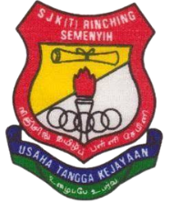
  
  ### **IOT RANGERS**
  **SJKT LADANG RINCHING · 2026**
  
  *Dengan Kerjasama & Sokongan Daripada:*<br/>
  <br/>
  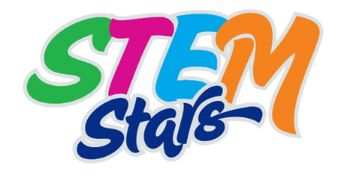 &nbsp;&nbsp;&nbsp;&nbsp;
  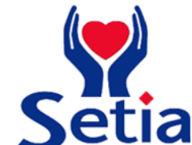 &nbsp;&nbsp;&nbsp;&nbsp;
  
  
  <br/><br/>
  <p><em>"Inovasi Kecil. Impak Yang Bermakna."</em></p>
</div>
